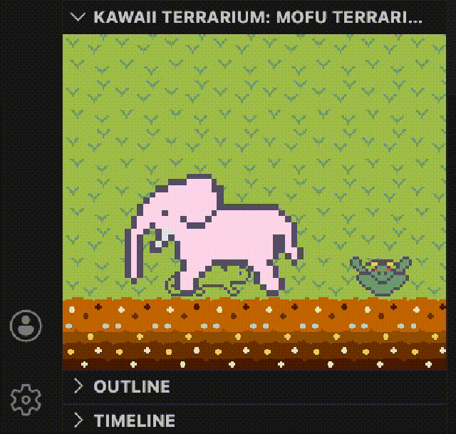

# Kawaii Terrarium 🌳✨

Cute Mofu characters living in your VS Code editor!
They simply roam around your workspace, bringing relaxation to your coding sessions.

## Features

- 🐱 **Adorable animated characters** - Cats, squirrels, hedgehogs, and elephants
- 🚶 **Smooth animations** - Characters walk around your editor with idle animations
- ✨ **Random appearances** - Characters randomly appear and disappear
- 🪟 **Secondary Sidebar support** - Mofu now lives in the right sidebar (secondary sidebar) by default!
- 🎮 **Easy controls** - Summon or dismiss Mofus via command palette

## Demo
- On Secondary SideBar  
   

- On panel  
   

## What is "Mofu"?

"Mofu" is the name of the characters in this extension and has two meanings:

1. **Morph** - The ability to transform into various adorable animals
2. **MofuMofu (もふもふ)** - A Japanese onomatopoeia meaning "soft and fluffy"

The name perfectly captures these cute, shape-shifting creatures! 🌸

## Usage

### Via Command Palette
1. Open Command Palette (`Cmd+Shift+P` on Mac, `Ctrl+Shift+P` on Windows/Linux)
2. Type "Kawaii Terrarium"
3. Select:
   - **Summon Mofu on Secondary Sidebar** - Show Mofus in the right sidebar
   - **Summon Mofu on Panel** - Show cute characters in your editor
   - **Dismiss Mofu from Panel** - Remove all characters from your editor

## Installation

1. Open VS Code
2. Go to Extensions (`Cmd+Shift+X` / `Ctrl+Shift+X`)
3. Search for "Kawaii Terrarium"
4. Click Install

Or install from VS Code Marketplace

## Characters

Each Mofu can transform into:
- 🐱 **Cats** (4 variants)
- 🐿️ **Squirrels** (2 variants)
- 🦔 **Hedgehogs** (2 variants)
- 🐘 **Elephants** (2 variants)
- 🐢 **Tortoises** (1 variant)
- 🐢 **Turtles** (1 variant)
- 🫏 **Horses** (3 variants)
- 🦆 **Ducks** (2 variants)

## Requirements

- Visual Studio Code ^1.107.0

## Known Issues

None at the moment. Please report issues on [GitHub](https://github.com/k2-gc/kawaii-terrarium/issues).

## Release Notes

See [CHANGELOG.md](./CHANGELOG.md) for detailed release notes.

### 0.1.0

Initial release of Kawaii Terrarium!

### 0.1.2

Added new Mofu characters: tortoise and turtle!

### 1.0.0🎉

Added Secondary SideBar support!

### 1.0.1

Added new Mofus: 3 horses!

### 1.0.2

Added new Mofus: 2 cats and 2 ducks!

## License

- **Source Code**: MIT License
- **Character Artwork** (`media/mofus/`, `media/logo/`): © 2025 Kazuki. All rights reserved.

See [LICENSE](./LICENSE) for full details.

## Contributing

Contributions are welcome! Please feel free to submit a Pull Request.

## Author

Created by [Kazuki](https://k2-gc.github.io/portfolio/)

---

**Enjoy your kawaii coding experience! 🌸**